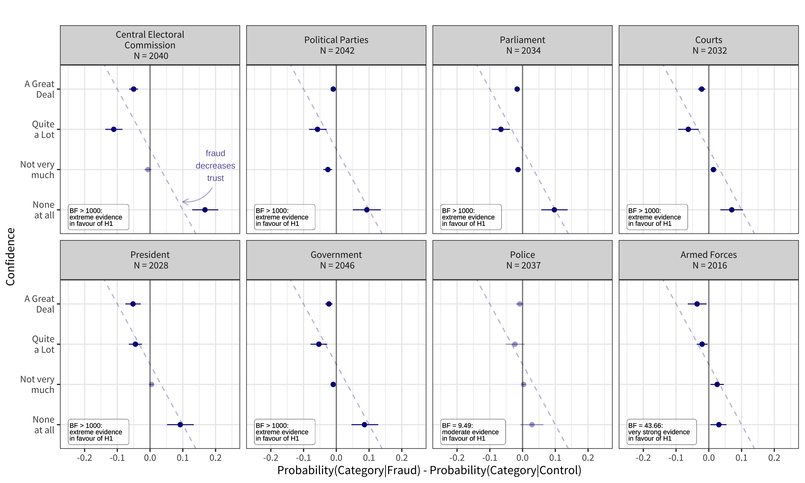

# Election Fraud Information, Punishment, and Political Trust: Evidence from a Survey Experiment in Colombia, Mexico, and Russia

### [Lion Behrens](https://github.com/Lion-Be) and [Viktoriia Semenova](https://github.com/vktrsmnv) 

---

### What the Project is about

Consciousness of election fraud has been shown to let individuals withdraw support from political candidates, institutions, and governments that are supposedly involved in manipulation. We show that negative effects of fraud information spread beyond electoral field to other political institutions, and citizens' confidence in these institutions in particular. Moreover, we show that how the political system responds to fraud information could make a difference: sufficient punishment for electoral crimes could restore and even strengthen trust in the institutions that are not directly involved in elections. 

---
### Our Survey Experiment

We conducted an online survey experiment in two Latin American countries, Colombia and Mexico, and in Russia in March-June 2021 with a total of 2402 participants recruited via a crowdsourcing platform [Yandex.Toloka](https://toloka.yandex.com/).  

For many political institutions, we find that probability of expressing more trust in them is lower when the respondent learns about fraud during the elections, and, conversely, the probabilities for expressing less trust are higher. 

---
### 

This repository contains replication material for the project, while the output files from Bayesian estimation are not uploaded due to space limitations. 
