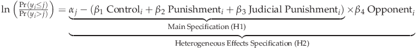
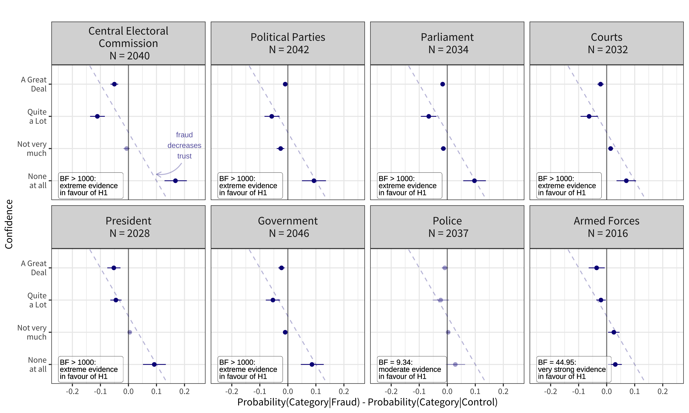

# Election Fraud Information, Punishment, and Political Trust: Evidence from a Survey Experiment in Colombia, Mexico, and Russia

### [Lion Behrens](https://github.com/Lion-Be) and [Viktoriia Semenova](https://github.com/vktrsmnv) 

---

Consciousness of election fraud has been shown to let individuals withdraw support from political candidates, institutions, and governments that are supposedly involved in manipulation. We show that negative effects of fraud information spread beyond electoral field to other political institutions, and citizens' confidence in these institutions in particular. Moreover, we show that how the political system responds to fraud information could make a difference: sufficient punishment for electoral crimes could restore and even strengthen trust in the institutions that are not directly involved in elections. 

---
### Our Survey Experiment

We conducted an online survey experiment in Russia and two Latin American countries, Colombia and Mexico, in March-June 2021 with a total of 2095 participants recruited via a crowd-sourcing platform [Yandex.Toloka](https://toloka.yandex.com/). Within each country, we randomize within current regime's opponents and supporters groups. 

Our respondents were randomly assigned into one of four treatment conditions:  

 - *Control*: upcoming elections description + a status quo scenario 
 - *Fraud*: upcoming elections description + ballot box fraud on election day  
 - *Punishment*: upcoming elections description + ballot box fraud on election day + guilty individuals were removed from election commissions
 - *Judicial punishment*: upcoming elections description + ballot box fraud on election day + guilty individuals were removed from election commissions and prosecuted 
 
We then asked the respondents to evaluate their confidence in political and non-political institutions, adopting the questions from the [World Value Survey](https://www.worldvaluessurvey.org/wvs.jsp). We also collected the information on political attitudes (pre-treatment) and socio-demographics (post-treatment). 

---

We use Bayesian approach for the analysis and estimate ordered logistic regressions with the following specifications:

For many political institutions, we find that probability of expressing more trust in them is lower when the respondent learns about fraud during the elections, and, conversely, the probabilities for expressing less trust are higher. We also relied on Bayes factor for hypothesis testing, such that:  . 

---
### 

This repository contains replication material for the project, while the output files from Bayesian estimation are not uploaded due to space limitations. 
